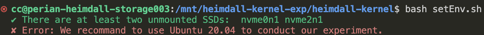
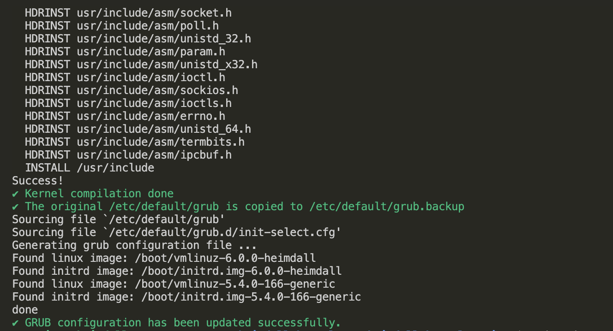
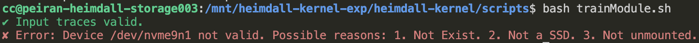
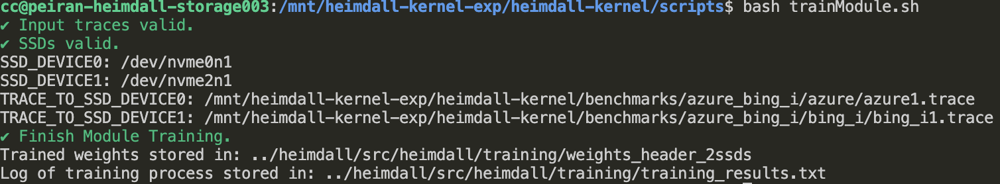
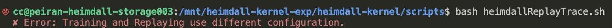

## Heimdall-Kernel Experiment

---

### Experiment Description

+ **Introduction:** To evaluate heimdall's performance in kernel, a real-time executing environment demanding fast response, we deploy heimdall into `Linux-6.0.0`. This experiment will replay IO workloads with the help of heimdall in kernel and finally produce a visualizable result of IO latencies for evaluation. 
+ **Baselines:** In this experiment, we provide the code of following methods as baselines to evaluate heimdall-kernel:
  1. Baseline: Submit IO to primary SSD without any redirection to secondary SSD.
  2. Random: Submit IO to any one of the SSDs randomly.
+ **Code:** Code related to this experiment are all included in directory: `Heimdall/integration/kernel-level`.
+ **Experiment Duration:** 1.5 hours. (Involve time-consuming processes like kernel compilation and model training)
+ **Recommended Testbed:** [Chameleon](https://www.chameleoncloud.org/) `storage_nvme` node under [CHI@UC](https://chi.uc.chameleoncloud.org/project/). 

Next, the experiment will begin with `Testbed Reservation`.

---

### Testbed Reservation

+ Please follow [testbed reservation guideline](./testbed_reservation.md) to reserve a `storage_nvme` node at CHI@UC site.

---

### Environment Setup

+ Please setup a workplace for kernel first:

  ```bash
  # If you already do this in previous experiments, skip this
  sudo mkdir -p /mnt/heimdall-kernel-exp    
  sudo chown $USER -R /mnt
  cd /mnt/heimdall-kernel-exp
  git clone https://github.com/ucare-uchicago/Heimdall.git
  ```

  ```bash
  cd /mnt/heimdall-kernel-exp/Heimdall/integration/kernel-level
  echo 'export HEIMDALL_KERNEL='$(pwd) >> ~/.bashrc
  source  ~/.bashrc
  ```

+ We provide you an automatic script to set up the environment. It will check whether your test machine meets the basic requirement of SSDs and OS version. Also, the script will install the dependencies of the experiment. You can run it by:

  ```bash
  cd $HEIMDALL_KERNEL/script
  bash setEnv.sh
  ```

  + The script will stop when error occurs like this: (Please check whether your testing machine really meets the requirement that error indicates. )

    

  + If the script successfully set up the environment, you should see the script finishes without any error.

---

### Heimdall Kernel Compilation

+ To compile the heimdall kernel and update the grub config, please run:

  ```bash
  cd $HEIMDALL_KERNEL/script
  sudo bash compileKernelHeimdall.sh
  ```

  + If the kernel is successfully compiled and the grub configuration is updated, you would see message like below:

    

+ Next, reboot your machine to let the compiled kernel be booted.

  ```bash
  sudo reboot
  ```

+ Use `uname -r` to check whether the kernel has been successfully changed:

  ```bash
  uname -r     # you shall see '6.0.0-heimdall'
  ```

---

### Heimdall Model Training

+ **[Configuration]** To train the heimdall module, you should first config the devices to the ones you want to used, as well as the traces you would like to test with. Please customize the configuration file in `$HEIMDALL_KERNEL/config/config.conf`. Four variables can be customized:

  + SSD_DEVICE0: the SSD device to use. (Should be a SSD which is not mounted. You cloud use `lsblk` command to check)
  + SSD_DEVICE1: another SSD device to use.  (Should be a SSD which is not mounted.)
  + TRACE_TO_SSD_DEVICE0: path of the trace you want to replay on `SSD_DEVICE0`. [Don't change this if wanna use default workload]
  + TRACE_TO_SSD_DEVICE1: path of the trace you want to replay on `SSD_DEVICE1`. [Don't change this if wanna use default workload]

  (`$HEIMDALL_KERNEL/config/config.conf` gives an example of how to compose this config file.)

+ After configuration, you can now train the model by running:

  ```bash
  cd $HEIMDALL_KERNEL/script
  bash trainModuleHeimdall.sh
  ```

  + This script will conduct two things: 1. Validate your configuration (whether the devices are usable, whether the traces exist). 2. Train and save the heimdall model. 

    + If your any of your configuration is wrong (e.g. use wrong device), you might see message like this:

      

    + Otherwise, if both the configuration checking and module training goes correct. you will see message like:

      

      + You can follow the path to check the trained weights which are represented in C header files and training log file.

---

### Trace Replaying (Heimdall, Baseline, Random)

+ In this section, we could move forward to replay traces with the help of heimdall. Also, we will replay with `Baseline` and `Random`. You could complete these by running:

  ```bash
  cd $HEIMDALL_KERNEL/script
  bash heimdallReplayTrace.sh
  ```

+ This script will do the following things:

  1. **[Configuration Alignment Check]** The configuration of replaying should be the same as the training (Use the same`$HEIMDALL_KERNEL/config/config.conf`). 

     + If the configurations between training and replaying are not aligned, you might see the error like this:

       

  2. **[Heimdall Compilation]** Compile Heimdall and other necessary modules. 
  
  3. **[Replaying]** This step will insert the necessary modules into kernel and enable heimdall. After the traces you specify in configuration will be replayed with the help of heimdall. If there is no error, you should see the scripts run smoothly to the end and output a message: `✔ Done.`. Then, you could follow the output message to locate the outcome of replaying.
  
     + **Except for the heimdall, this script will also replay traces with the help of:**
       + **Baseline**: Submit IO to primary SSD without any redirection to secondary SSD.
       + **Random**: Submit IO to any one of the SSDs randomly.

---

### Result Visualization

+ After finishing the above steps, the results can be visualized by:

  ```bash
  cd $HEIMDALL_KERNEL/script
  python3 plot_figure.py
  ```

+ Two figures will be plotted:

  1. The first one is the bar graph of average IO latencies of replaying the workload using Heimdall, Random and Baseline.
  2. The second figure is the line chart of percentiles latency of Heimdall, Random and Baseline.


