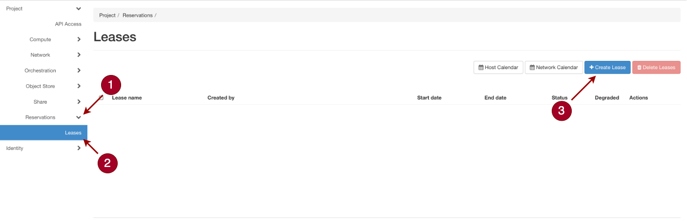
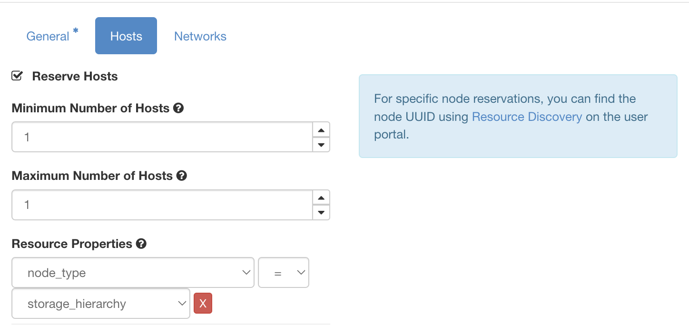
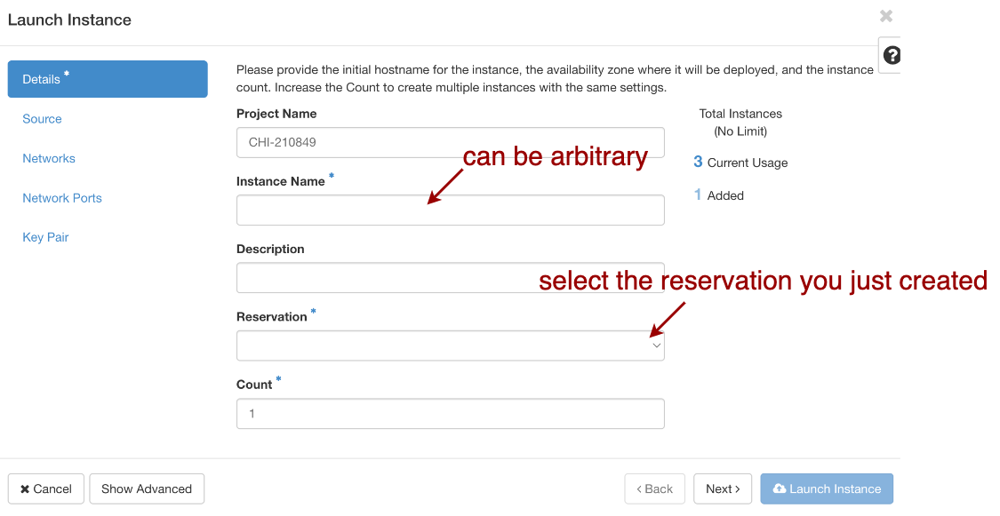
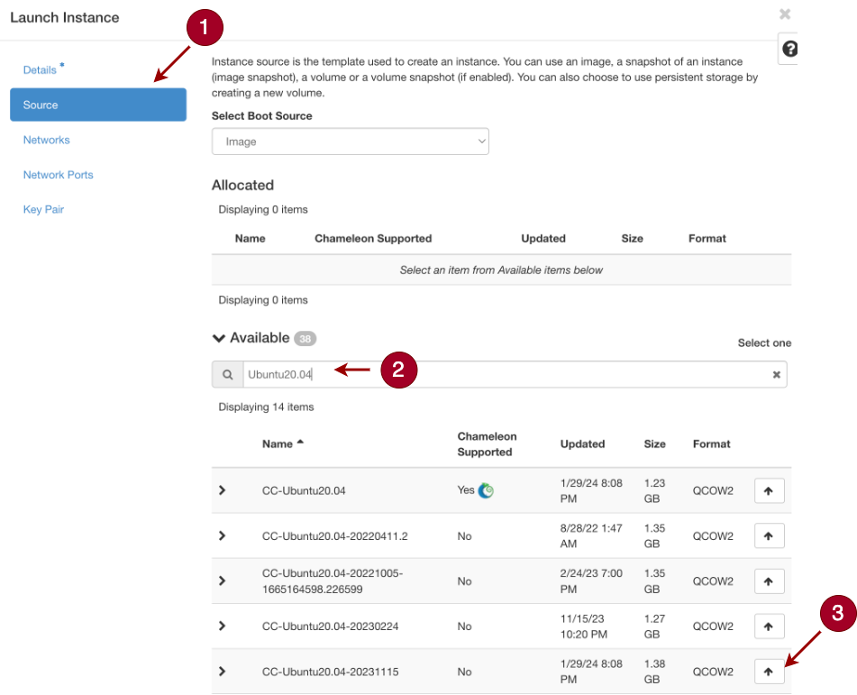
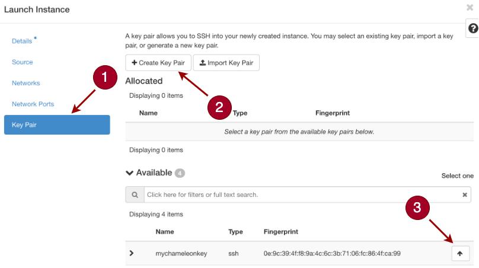
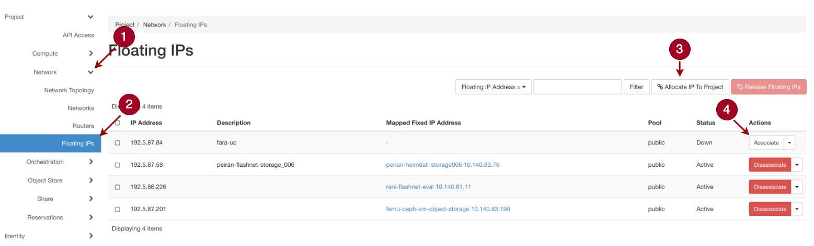

## Testbeds Reservation Guideline

---

### Let's Prepare the Testbeds for Heimdall!

+ We have conducted extensive experiments to evaluate Heimdall. Each of the six experiments was carried out using nodes provided by [Chameleon](https://www.chameleoncloud.org/). For consistency and comparability, we recommend you to also conduct these experiments on Chameleon nodes or similar testbeds and begin with the same very first step: **Machine Reservation**.

+ The following chart summarizes the machine specifications for each experiment:

  | Experiment                                                  | Chameleon Site | Node Type         |
  | ----------------------------------------------------------- | -------------- | ----------------- |
  | [heimdall_pipeline](./1_heimdall_pipeline.md)               | CHI@TACC       | Storage hierarchy |
  | [joint_inference](./2_joint_inference.md)                   | CHI@TACC       | Storage hierarchy |
  | [client_level_integration](./3_client_level_integration.md) | CHI@TACC       | Storage hierarchy |
  | [kernel_level_integration](./4_kernel_level_integration.md) | CHI@UC         | Storage nvme      |

  + Some experiments use the same type of machine and can be kept using.
  + **Supplementary**: If you meet any obstacles when following the reservation guidelines we provided, you might find this [document of Chameleon](https://chameleoncloud.readthedocs.io/en/latest/getting-started/index.html#getting-started) helpful.

+ Please follow the bellowing guideline to reserve a corresponding node.

---

### How to Reserve a Node?

+ The below guideline will take "how to reserve a `storage_hierarchy` node at CHI@TACC site" as an example. 
  + Reserve `compute_icelake` at CHI@TACC site is almost the same. The only difference is to select `compute_icelake_r650` when picking the node type.
  + Reserve `storage_nvme` at CHI@UC site is also almost the same. But please go to the [CHI@UC site](https://chi.uc.chameleoncloud.org/project/leases/) instead of going to CHI@TACC site, and to select `storage_nvme` when picking the node type.

+ **Lease Reservation:** Our [kernel level integration](./6_kernel_level_integration.md) experiments are conducted on site: [CHI@TACC](https://chi.tacc.chameleoncloud.org/project/leases/), with specific node type: `storage_hierarchy`. You could reserve the node by:

  1. Login to Chameleon CHI@TACC side: Click [this](https://chi.tacc.chameleoncloud.org/project/leases/).

  2. Click "Reservations"=>"Leases". 

  3. Click "Create Lease". 

     

  4. Fill in the "Lease name": heimdall_eval

  5. Pick a `storage_hierarchy` node by node type:

     

+ **Launching an Instance:** After create a reservation, you can launch an instance on that machine by:

  1. In the sidebar, click "Compute", then click "Instances".

  2. Click "Launch Instance"

     

  3. Pick the reservation you just created.

     

  4. Click Source. Image: pick "CC-Ubuntu20.04-20231115"

     

  5. Create and store the ssh key as "mychameleonkey.pem"

     

+ **Allocate floating IPs:** Next, we will allocate an IP for this instance:

  1.  In the sidebar, click "Network -> Floating IPs"

  2. Click "Allocate IP To Project"

  3. Click "Associate".

  4. Pick the instance you launched and enter.

     

+ **Connect to the node:** After the instance is ready, you could connect to the node using ssh:

  ```bash
  chmod 600 mychameleonkey.pem    # the key you create and store during launching an instance
  
  ssh-add mychameleonkey.pem
  
  ssh cc@`ip_address`      # the ip address is what you allocated and associated.
  ```